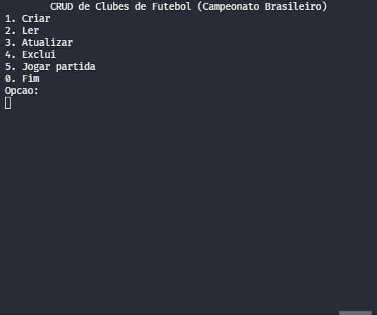
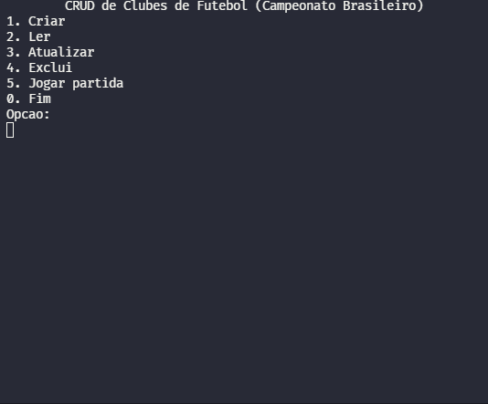
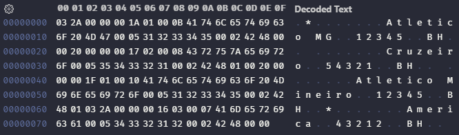

  <h3>CRUD de Clubes</h3>

<h4 align="center">Um programa que simula um CRUD em memória secundária para o controle de um campeonato!</h4>

 <a href="#sobre">Sobre</a> •
 <a href="#funcionalidades">Funcionalidades</a> • 
 <a href="#resultado">Resultado</a> • 
 <a href="#autor">Autor</a>

<h3 id="sobre">Sobre</h3>

Este projeto foi desenvolvido em Java para um trabalho de AEDS III! 👨‍💻

Esse é um sistema de CRUD de Clubes de futebol. O objetivo era estudar e aprender mais sobre operações em memória secundária, por isso todas as alterações são salvas em um arquivos de dados em que é possível recuperar os dados inseridos pelo usuário. Além de que os dados seriam armazenados e dessa forma não seriam perdidos ao fim do programa.

<h3 id="funcionalidades">Funcionalidades</h3>
<ul>
  <li>Adicionar um Clube (C - Create)</li>
    
  <li>Procurar por um Clube (R - Read)</li>
    
  <li>Editar um Clube (U - Update)</li>
    
  <li>Deletar um Clube (D - Delete)</li>
    
  <li>Um Clube jogar contra o outro</li>
    
</ul>

<h3 id="resultado">Resultado</h3>

  

---

<h3 id="autor">Autor</h3>
<table>
  <tr>
    <td align="center">
      <a href="https://github.com/davidsonmarra">
         
        
          <b>Davidson Marra</b>
        
      </a>
    </td>
    <td align="center">
      <a href="https://github.com/phtsouza">
         
        
          <b>Pedro Teixeira</b>
        
      </a>
    </td>
  </tr>
</table>
